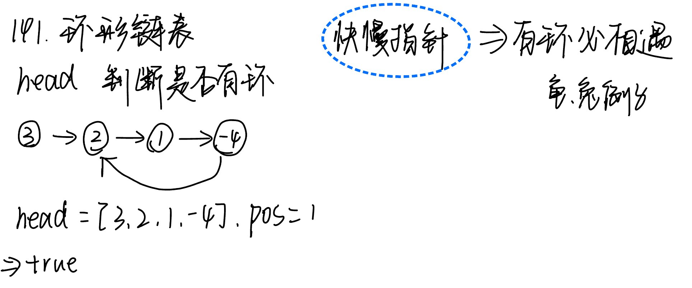

# 141. 环形链表

题目地址： [141. 环形链表](https://leetcode.cn/problems/linked-list-cycle/?envType=study-plan-v2&envId=top-100-liked)



```c++
class Solution {
public:
    bool hasCycle(ListNode *head) {
        ListNode* slow = head, * fast = head;
        while(fast && fast->next){
            slow = slow->next;
            fast = fast->next->next;
            if(fast == slow) return true; // 有环必相遇
        }
        return false;
    }
};
```