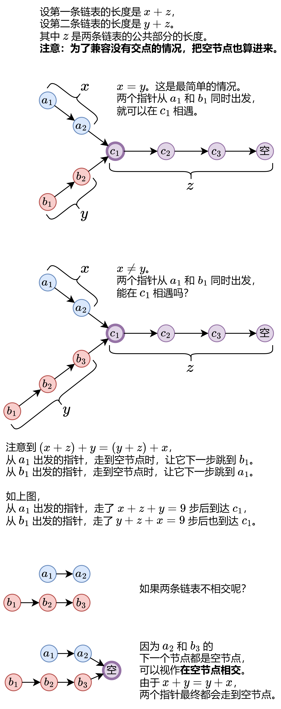

# 160. 相交链表

题目地址： [160. 相交链表](https://leetcode.cn/problems/intersection-of-two-linked-lists/description/?envType=study-plan-v2&envId=top-100-liked)



``` c++
/**
 * Definition for singly-linked list.
 * struct ListNode {
 *     int val; // 值
 *     ListNode *next; // 下个节点
 *     ListNode(int x) : val(x), next(NULL) {}
 * };
 */

class Solution {
public:
    ListNode* getIntersectionNode(ListNode* headA, ListNode* headB) {
        ListNode *p = headA, *q = headB;
        while(p != q){
            p = p ? p->next : headB;
            q = q ? q->next : headA;
        }
        return p;
    }
};
```