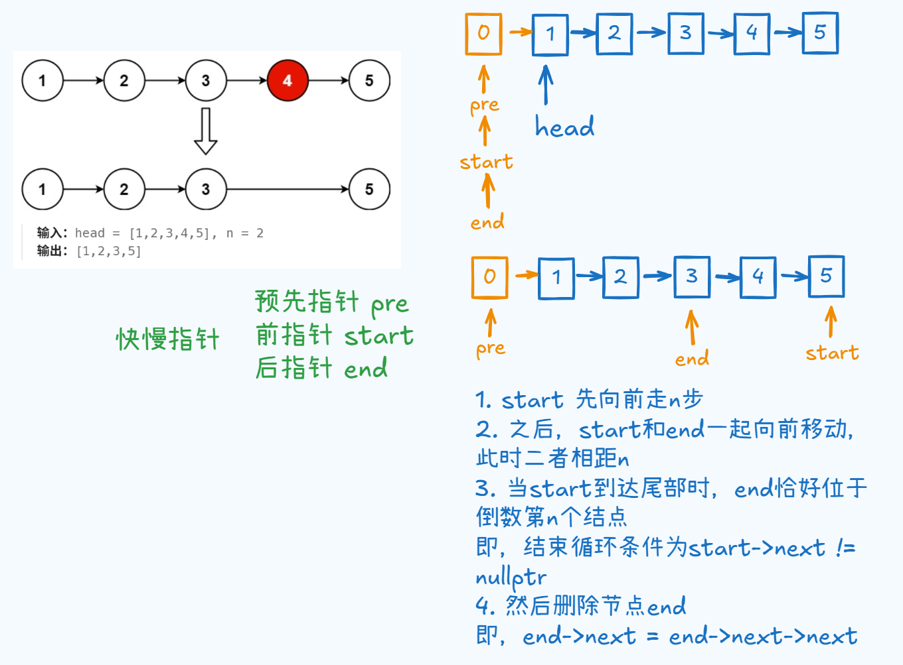

# 19. 删除链表的倒数第N个结点

题目地址： [19. 删除链表的倒数第N个结点](https://leetcode.cn/problems/remove-nth-node-from-end-of-list/description/?envType=study-plan-v2&envId=top-100-liked)



### 快慢指针问题

```c++
class Solution {
public:
    ListNode* removeNthFromEnd(ListNode* head, int n) {
        ListNode pre{0, head};

        ListNode *start = &pre, *end = &pre;
        for(int i = 0; i < n; i++){
            start = start->next;
        }
        while(start->next != nullptr){
            start = start->next;
            end = end->next;
        }
        end->next = end->next->next;

        return pre.next;
    }
};
```