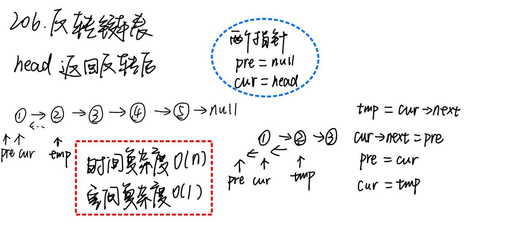

# 206. 反转链表

题目地址： [206. 反转链表](https://leetcode.cn/problems/reverse-linked-list/?envType=study-plan-v2&envId=top-100-liked)



```c++
class Solution {
public:
    ListNode* reverseList(ListNode* head) {
        ListNode *pre = nullptr, *cur = head;

        while(cur){ // 一定记住cur指向空退出循环 ，最后返回pre
            ListNode *tmp = cur->next;
            cur->next = pre;
            pre = cur;
            cur = tmp;
        } 

        return pre;
    }
};
```