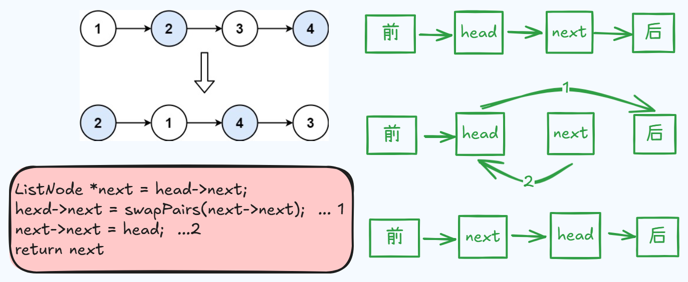

# 24. 两两交换链表中的节点

题目地址： [24. 两两交换链表中的节点](https://leetcode.cn/problems/swap-nodes-in-pairs/description/?envType=study-plan-v2&envId=top-100-liked)




```c++
class Solution {
public:
    ListNode* swapPairs(ListNode* head) {
        if(head == nullptr || head->next == nullptr){
            return head;
        }
        ListNode *next = head->next;
        head->next = swapPairs(next->next);
        next->next = head;
        return next;
    }
};
```