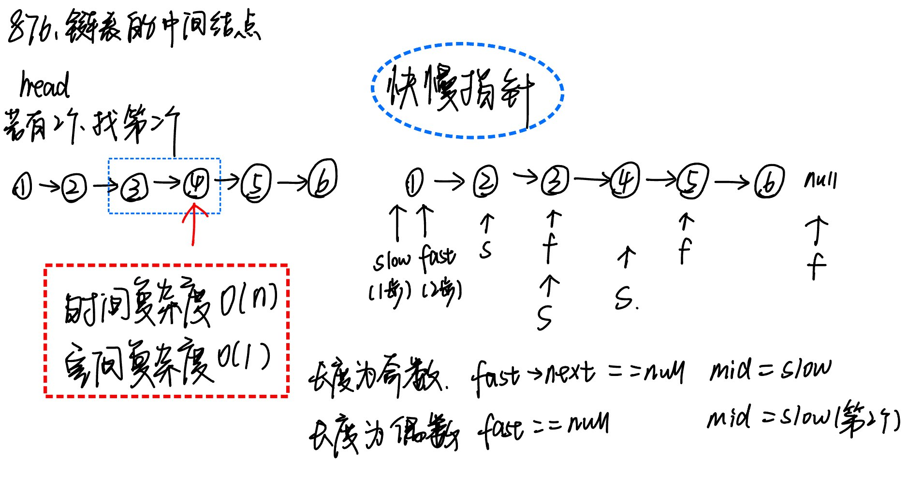

# 876.链表的中间结点

题目地址： [876. 链表的中间结点](https://leetcode.cn/problems/middle-of-the-linked-list/description/)

### 快慢指针问题


```c++
/**
 * Definition for singly-linked list.
 * struct ListNode {
 *     int val;
 *     ListNode *next;
 *     ListNode() : val(0), next(nullptr) {}
 *     ListNode(int x) : val(x), next(nullptr) {}
 *     ListNode(int x, ListNode *next) : val(x), next(next) {}
 * };
 */
class Solution {
public:
    ListNode* middleNode(ListNode* head) {
       ListNode* fast = head, * slow = head;
       while(fast && fast->next){
            slow = slow->next;
            fast = fast->next->next;
       } 
       return slow;
    }
};
```