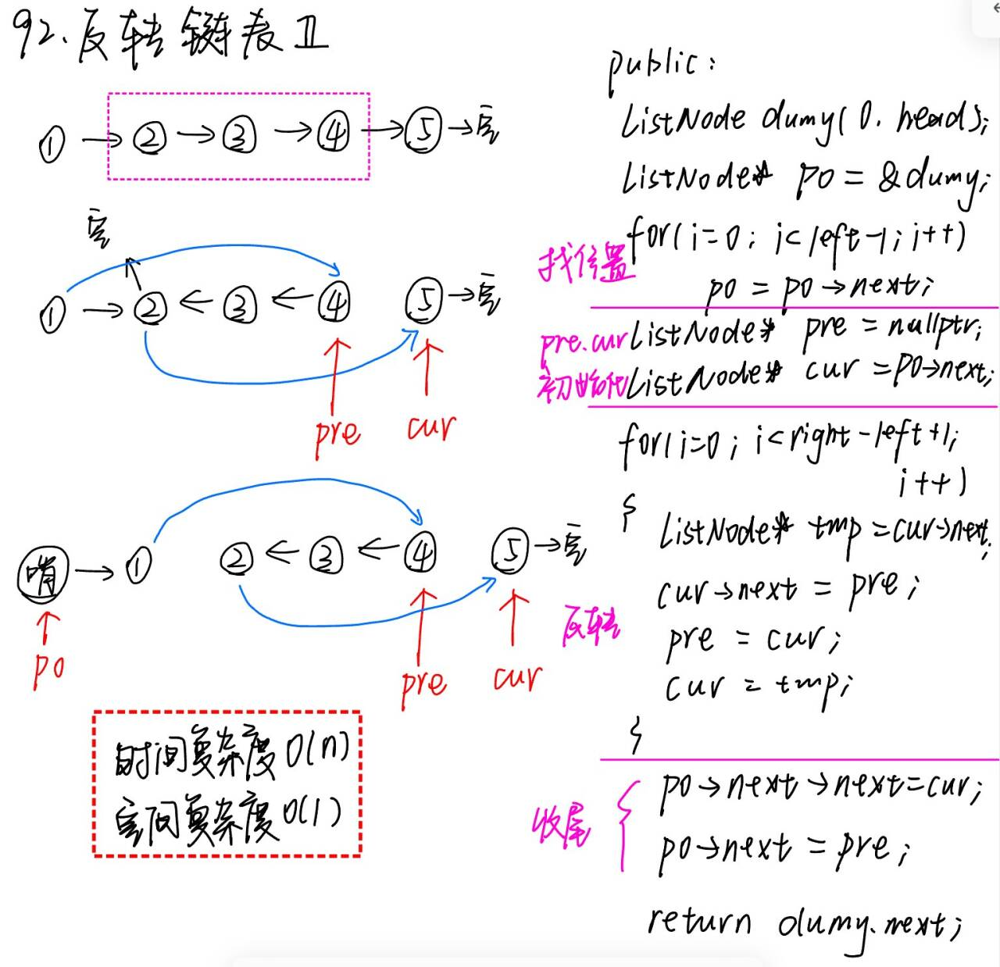

# 92. 反转链表2

题目地址： [92. 反转链表2](https://leetcode.cn/problems/reverse-linked-list-ii/description/)



```c++
/**
 * Definition for singly-linked list.
 * struct ListNode {
 *     int val;
 *     ListNode *next;
 *     ListNode() : val(0), next(nullptr) {}
 *     ListNode(int x) : val(x), next(nullptr) {}
 *     ListNode(int x, ListNode *next) : val(x), next(next) {}
 * };
 */
class Solution {
public:
    ListNode* reverseBetween(ListNode* head, int left, int right) {
        ListNode dumy(0, head);
        ListNode* p0 = &dumy;
        for(int i = 0; i < left - 1; i++){
            p0 = p0->next;
        }

        ListNode* pre = nullptr;
        ListNode* cur = p0->next;
        for(int i = 0; i < right - left + 1; i++){
            ListNode* tmp = cur->next;
            cur->next = pre;
            pre = cur;
            cur = tmp;
        }

        p0->next->next = cur;
        p0->next = pre;
        return dumy.next;
    }
};
```